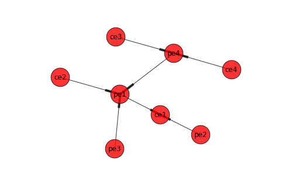

# Interactive SDN/IOT with tega db and Jupyter/IPython


This project nlan (meaning "new LAN") unifies outputs from my two other projects "[neutron-lan](https://github.com/araobp/neutron-lan)" and "[tega](https://github.com/araobp/tega)".

##Background and motivation
- OpenDaylight MD-SAL is too heavy for networking Linux containers on my Raspberry Pi.
- YANG is incompatible with Python dict, Golang map and so on: I just want JSON-centric MD-SAL.
- As my hobby, I design a model-driven/event-driven architecture for networking Linux containers.
- I think Jupyter/IPython is a wonderful IDE for SDN/IOT.
- If the computing power moves to the network edge, what you need is not VLAN but application-level logical seperation of network (SSL/TLS, WebSocket, RTP/RTCP, ...), that is, what you need is "session".

##Architecture
Sort of "immutable infrastructure" for networking...


##Visualization and analytics
I use Jupyter and IPython for visualization and analytics of NLAN.
```
import networkx as nx
get_ipython().magic('matplotlib inline')

import tega.driver
d = tega.driver.Driver(host='192.168.57.133')
subnets = d.get(path='graph.subnets')

g = nx.DiGraph(subnets['172.21.1.0/24'])
nx.draw_spring(g, node_size=1000, with_labels=True, arrows=True, alpha=0.8)
```


###Jupyter notebook examples
- [PTN topology](./doc/jupyter/topo.md)
- [Subnet graph set up by BGP at each router](./doc/jupyter/BGP_route_graph.md)
- [Server-client graph from netstat at each router](./doc/jupyter/server_client.md)

##NLAN services
- PTN: Packet Transport Network (Layer 1 and Layer 2)
- vHosts: netns-based virtual hosts
- Router: Quagga configuration

To be added:
- DVR: Distributed Virtual Switch and Distributed Virtual Router (Layer 2 and Layer 3)
- Links: direct linking(tun/tap)
- Bridges: non-distributed virtual switch
- VRF: netns-based VRF
- container-macvlan direct linking (skipping docker0)
- [netlink](https://github.com/vishvananda/netlink) in addition to "ip" and "brctl"

##Target use cases

Use case 1 has already been implemented, and use case 2 is being planned at the moment.

### Use case 1: Network simulation

This use case makes use of NLAN's PTN, vHosts and Router services.


####Declarative state representations:
- [ptn-bgp.yaml](./etc/ptn-bgp.yaml)
- [ptn-ospf.yaml](./etc/ptn-ospf.yaml)

####Data trees on tega db


####Running the simulated network on Raspberry Pi
This is sort of micro NFV(Network Function Virtualization) on a single Rapsberry Pi.
- Nine virtual routers (Linux containers)
- Sixteen virutal hosts (netns)

You can learn how routing protocols work on this simulated network.

[Setting up the software on Raspberry Pi](./doc/RPI.md)

Log in the virtual routers with ssh, and try "ip" or "vtysh" commands:
- ip route
- ip addr
- ip link
- ip netns
- vtysh: show run
- vtysh: show ip route
- vtysh: show ip bgp
     :

####Quagga and GoBGP:
This use case makes use of Quagga, but [gobgp](https://github.com/osrg/gobgp) may optionally be used as Route Reflector or Route Server on "RR" container in the fig above.
- [gobgpd.conf](./etc/gobgpd.conf)

You can also launch gobgpd from NLAN agent by including "EmbeddedBgp: true" in your NLAN state file:
```
      Router:
        Loopback: 10.1.1.5/32
        EmbeddedBgp: true
        Bgp:
          - As: 100
            Neighbors:
              - Peer: 10.200.1.101
                RemoteAs: 100
                RouteReflectorClient: true
              - Peer: 10.200.1.102
                RemoteAs: 100
                RouteReflectorClient: true
              - Peer: 10.200.1.103
                RemoteAs: 100
                RouteReflectorClient: true
              - Peer: 10.200.1.104
                RemoteAs: 100
                RouteReflectorClient: true
```
- [Using gobgp command](./doc/GOBGP.md)

### Use case 2: SOHO NFV (Network Functions Virtualization)

This is the next use case I am going to work on... (as my hobby: not so practical)


##Network simulation with Linux containers
I use Linux containers as virtual routers, and this tool will set up virtual links (L0/L1) and virtual switches (L2) over the containers. Then I will run Quagga/Zebra(L3) daemons over the virtual routers to study how legacy routing protocols work.
- [An example of such a network](https://camo.githubusercontent.com/3f15c9634b2491185ec680fa5bb7d19f6f01146b/68747470733a2f2f646f63732e676f6f676c652e636f6d2f64726177696e67732f642f31564b664b6c776e7a5751322d496d6658654235754e656747424b30426e6147555f346c53386834517063772f7075623f773d39363026683d373230)
- [Working with Docker for network simulation](https://camo.githubusercontent.com/77cf473ea9499432e57b06a951f5f5248419f9e1/68747470733a2f2f646f63732e676f6f676c652e636f6d2f64726177696e67732f642f313631426e383077384a5a4b513742586d496f306272377851346b71456442635f585a3235347a754f5253552f7075623f773d36383026683d343030)

#NLAN installation

[Step 1] Make a Docker image named "router" following the instruction [here](./docker/SETUP.md).

[Step 2] Install and start tega db:

You need to have Python3.5 installed on your Ubuntu/Debian.

```
$ go get github.com/araobp/tega/driver
$ cd $GOPATH/src/github.com/araobp/tega
$ python setup.py install
$ pip install mako
```
For Hypriot/RaspberryPi, you need to export this environment variable:
```
$ export SETUP_SCRIPT=setup_rpi.sh
```
For Debian/Ubuntu, you do not need to export the variable above. 

Then start tega db:
```
$ cd scripts
$ ./tegadb &

   __
  / /____  ____ _____ _
 / __/ _ \/ __ `/ __ `/
/ /_/  __/ /_/ / /_/ /
\__/\___/\__, /\__,_/
        /____/

tega_id: global, config: None, operational: None

Namespace(config=None, datadir='./var', extensions='/root/work/src/github.com/araobp/nlan/plugins/nlan', loglevel='INFO', maxlen=10, mhost=None, mport=None, operational=None, port=8888, tegaid='global')
INFO:2016-02-25 15:24:57,628:Reloading log from ./var...
INFO:2016-02-25 15:24:57,633:Reloading done
INFO:2016-02-25 15:24:58,119:plugin attached to idb: Deployment
INFO:2016-02-25 15:24:58,124:plugin attached to idb: Topo
INFO:2016-02-25 15:24:58,158:plugin attached to idb: IpAddressManagement
INFO:2016-02-25 15:24:58,181:plugin attached to idb: Template
```

[Step 3] Execute plugins.ipam (IP address management) function on tega db to generate (secondary) IP addresses of each containers:
```
$ tega-cli
[tega: 1] plugins.ipam('10.10.10.1','pe1','pe2','pe3','pe4','rr','ce1','ce2','ce3','ce4')
[tega: 2] get ip
{ce1: 10.10.10.6/2, ce2: 10.10.10.7/2, ce3: 10.10.10.8/2, ce4: 10.10.10.9/2, pe1: 10.10.10.1/24,
  pe2: 10.10.10.2/24, pe3: 10.10.10.3/24, pe4: 10.10.10.4/24, rr: 10.10.10.5/2}
```
[Step 3]
Try this at the tega CLI to put "ptn-bgp" state onto tega db: 
```
[tega: 3] plugins.template('ptn-bgp.yaml')
```
The script sets up [this network](https://camo.githubusercontent.com/3f15c9634b2491185ec680fa5bb7d19f6f01146b/68747470733a2f2f646f63732e676f6f676c652e636f6d2f64726177696e67732f642f31564b664b6c776e7a5751322d496d6658654235754e656747424b30426e6147555f346c53386834517063772f7075623f773d39363026683d373230).

[Step 4(option)]
You may take a snapshop of tega db to make tega db's start-up faster:
```
[tega: 4] ss 
```

[Step 5] Execute the following command to build Docker image with NLAN agent embedded and to start the containers:

```
[tega: 5] plugins.deploy() 
```

NLAN agent on each container connects to tega db to fetch NLAN state.

If you want to monitor the activities of each agents, subscribe(path="hosts") on the CLI ([example](./doc/monitoring-activities.md)).

[Step 6] Confirm that all the containers are running

```
[tega: 6] subscribers
Deployment: [Deployment]
IpAddressManagement: [IpAddressManagement]
Template: [Template]
Topo: [Topo, config-.*]
ce1: [ce1]
ce2: [ce2]
ce3: [ce3]
ce4: [ce4]
pe1: [pe1]
pe2: [pe2]
pe3: [pe3]
pe4: [pe4]
rr: [rr]

```

[Step 7] Try raw commands to check the state of each container

```
[tega: 7] raw.ce1('ip route')
default via 172.17.0.1 dev eth0
10.1.1.1 via 10.201.11.1 dev int_br111  proto zebra
10.1.1.2 via 10.202.11.1 dev int_br211  proto zebra
10.1.1.3 via 10.201.11.1 dev int_br111  proto zebra
10.1.2.2 via 10.201.11.1 dev int_br111  proto zebra
10.1.2.3 via 10.201.11.1 dev int_br111  proto zebra
10.1.2.4 via 10.201.11.1 dev int_br111  proto zebra
10.10.10.0/24 dev eth0  proto kernel  scope link  src 10.10.10.6
10.200.1.0/24 via 10.201.11.1 dev int_br111  proto zebra
10.200.2.0/24 via 10.201.11.1 dev int_br111  proto zebra
10.201.11.0/24 dev int_br111  proto kernel  scope link  src 10.201.11.2
10.201.12.0/24 via 10.201.11.1 dev int_br111  proto zebra
10.202.11.0/24 dev int_br211  proto kernel  scope link  src 10.202.11.2
10.202.12.0/24 via 10.202.11.1 dev int_br211  proto zebra
10.203.13.0/24 via 10.201.11.1 dev int_br111  proto zebra
10.203.14.0/24 via 10.201.11.1 dev int_br111  proto zebra
10.204.13.0/24 via 10.201.11.1 dev int_br111  proto zebra
10.204.14.0/24 via 10.201.11.1 dev int_br111  proto zebra
172.17.0.0/16 dev eth0  proto kernel  scope link  src 172.17.0.7
172.21.1.0/24 dev br_172.21.1.1  proto kernel  scope link  src 172.21.1.1
172.21.2.0/24 via 10.201.11.1 dev int_br111  proto zebra
172.21.3.0/24 via 10.201.11.1 dev int_br111  proto zebra
172.21.4.0/24 via 10.201.11.1 dev int_br111  proto zebra
172.22.1.0/24 dev br_172.22.1.1  proto kernel  scope link  src 172.22.1.1
172.22.2.0/24 via 10.201.11.1 dev int_br111  proto zebra
172.22.3.0/24 via 10.201.11.1 dev int_br111  proto zebra
172.22.4.0/24 via 10.201.11.1 dev int_br111  proto zebra

[tega: 8] raw.ce2('ip route')
               :
               
```
You may also start a ssh session to the containers:
```
$ cd scripts 
$ ./ssh.sh pe1
       :
$ ./ssh.sh ce1
       :
```
The password is "root".

[Step 8] Call hook functions to reflesh operational data trees
```
[tega: 9] plugins.hook() 
```

[Step 9] Check the operational trees
```
[tega: 10] getr operational-(\w*)\.ip
operational-ce1.ip:
  groups:
  - [ce1]
  instance:
    addr: {10.1.2.1: lo, 10.10.10.6: eth0, 10.201.11.2: int_br111, 10.202.11.2: int_br211,
      127.0.0.1: lo, 172.17.0.7: eth0, 172.21.1.1: br_172.21.1.1, 172.22.1.1: br_172.22.1.1}
    dev:
      br_172.21.1.1: [172.21.1.1]
      br_172.22.1.1: [172.22.1.1]
      eth0: [172.17.0.7, 10.10.10.6]
      int_br111: [10.201.11.2]
      int_br211: [10.202.11.2]
      lo: [127.0.0.1, 10.1.2.1]
    hook: {addr: '%ce1.ipAddr', route: '%ce1.ipRoute'}
    route:
      10.1.1.1/32: {Dev: int_br111, Src: '', Via: 10.201.11.1}
      10.1.1.2/32: {Dev: int_br211, Src: '', Via: 10.202.11.1}
      10.1.1.3/32: {Dev: int_br111, Src: '', Via: 10.201.11.1}
      10.1.1.4/32: {Dev: int_br111, Src: '', Via: 10.201.11.1}
      10.1.2.2/32: {Dev: int_br111, Src: '', Via: 10.201.11.1}
      10.1.2.3/32: {Dev: int_br111, Src: '', Via: 10.201.11.1}
      10.1.2.4/32: {Dev: int_br211, Src: '', Via: 10.202.11.1}
      10.10.10.0/24: {Dev: eth0, Src: 10.10.10.6, Via: ''}
      10.200.1.0/24: {Dev: int_br111, Src: '', Via: 10.201.11.1}
      10.200.2.0/24: {Dev: int_br111, Src: '', Via: 10.201.11.1}
      10.201.11.0/24: {Dev: int_br111, Src: 10.201.11.2, Via: ''}
      10.201.12.0/24: {Dev: int_br111, Src: '', Via: 10.201.11.1}
      10.202.11.0/24: {Dev: int_br211, Src: 10.202.11.2, Via: ''}
      10.202.12.0/24: {Dev: int_br211, Src: '', Via: 10.202.11.1}
      10.203.13.0/24: {Dev: int_br111, Src: '', Via: 10.201.11.1}
      10.203.14.0/24: {Dev: int_br111, Src: '', Via: 10.201.11.1}
      10.204.13.0/24: {Dev: int_br111, Src: '', Via: 10.201.11.1}
      10.204.14.0/24: {Dev: int_br111, Src: '', Via: 10.201.11.1}
      172.17.0.0/16: {Dev: eth0, Src: 172.17.0.7, Via: ''}
      172.21.1.0/24: {Dev: br_172.21.1.1, Src: 172.21.1.1, Via: ''}
      172.21.2.0/24: {Dev: int_br111, Src: '', Via: 10.201.11.1}
      172.21.3.0/24: {Dev: int_br111, Src: '', Via: 10.201.11.1}
      172.21.4.0/24: {Dev: int_br211, Src: '', Via: 10.202.11.1}
      172.22.1.0/24: {Dev: br_172.22.1.1, Src: 172.22.1.1, Via: ''}
      172.22.2.0/24: {Dev: int_br111, Src: '', Via: 10.201.11.1}
      172.22.3.0/24: {Dev: int_br111, Src: '', Via: 10.201.11.1}
      172.22.4.0/24: {Dev: int_br211, Src: '', Via: 10.202.11.1}
      default: {Dev: eth0, Src: '', Via: 172.17.0.1}
operational-ce2.ip:
  groups:
  - [ce2]
  instance:
    addr: {10.1.2.2: lo, 10.10.10.7: eth0, 10.201.12.2: int_br112, 10.202.12.2: int_br212,
      127.0.0.1: lo, 172.17.0.8: eth0, 172.21.2.1: br_172.21.2.1, 172.22.2.1: br_172.22.2.1}
    dev:
      br_172.21.2.1: [172.21.2.1]
      br_172.22.2.1: [172.22.2.1]
      eth0: [172.17.0.8, 10.10.10.7]
      int_br112: [10.201.12.2]
      int_br212: [10.202.12.2]
      lo: [127.0.0.1, 10.1.2.2]
    hook: {addr: '%ce2.ipAddr', route: '%ce2.ipRoute'}
    route:
      10.1.1.1/32: {Dev: int_br112, Src: '', Via: 10.201.12.1}
      10.1.1.2/32: {Dev: int_br212, Src: '', Via: 10.202.12.1}
      10.1.1.3/32: {Dev: int_br212, Src: '', Via: 10.202.12.1}
      10.1.1.4/32: {Dev: int_br112, Src: '', Via: 10.201.12.1}
      10.1.2.1/32: {Dev: int_br212, Src: '', Via: 10.202.12.1}
      10.1.2.3/32: {Dev: int_br212, Src: '', Via: 10.202.12.1}
      10.1.2.4/32: {Dev: int_br212, Src: '', Via: 10.202.12.1}
      10.10.10.0/24: {Dev: eth0, Src: 10.10.10.7, Via: ''}
      10.200.1.0/24: {Dev: int_br212, Src: '', Via: 10.202.12.1}
      10.200.2.0/24: {Dev: int_br212, Src: '', Via: 10.202.12.1}
      10.201.11.0/24: {Dev: int_br112, Src: '', Via: 10.201.12.1}
      10.201.12.0/24: {Dev: int_br112, Src: 10.201.12.2, Via: ''}
      10.202.11.0/24: {Dev: int_br212, Src: '', Via: 10.202.12.1}
      10.202.12.0/24: {Dev: int_br212, Src: 10.202.12.2, Via: ''}
      10.203.13.0/24: {Dev: int_br212, Src: '', Via: 10.202.12.1}
      10.203.14.0/24: {Dev: int_br212, Src: '', Via: 10.202.12.1}
      10.204.13.0/24: {Dev: int_br112, Src: '', Via: 10.201.12.1}
      10.204.14.0/24: {Dev: int_br112, Src: '', Via: 10.201.12.1}
      172.17.0.0/16: {Dev: eth0, Src: 172.17.0.8, Via: ''}
      172.21.1.0/24: {Dev: int_br212, Src: '', Via: 10.202.12.1}
      172.21.2.0/24: {Dev: br_172.21.2.1, Src: 172.21.2.1, Via: ''}
      172.21.3.0/24: {Dev: int_br212, Src: '', Via: 10.202.12.1}
      172.21.4.0/24: {Dev: int_br212, Src: '', Via: 10.202.12.1}
      172.22.1.0/24: {Dev: int_br212, Src: '', Via: 10.202.12.1}
      172.22.2.0/24: {Dev: br_172.22.2.1, Src: 172.22.2.1, Via: ''}
      172.22.3.0/24: {Dev: int_br212, Src: '', Via: 10.202.12.1}
      172.22.4.0/24: {Dev: int_br212, Src: '', Via: 10.202.12.1}
      default: {Dev: eth0, Src: '', Via: 172.17.0.1}
operational-ce3.ip:
  groups:
  - [ce3]
  instance:
    addr: {10.1.2.3: lo, 10.10.10.8: eth0, 10.203.13.2: int_br313, 10.204.13.2: int_br413,
      127.0.0.1: lo, 172.17.0.9: eth0, 172.21.3.1: br_172.21.3.1, 172.22.3.1: br_172.22.3.1}
    dev:
      br_172.21.3.1: [172.21.3.1]
      br_172.22.3.1: [172.22.3.1]
      eth0: [172.17.0.9, 10.10.10.8]
      int_br313: [10.203.13.2]
      int_br413: [10.204.13.2]
      lo: [127.0.0.1, 10.1.2.3]
    hook: {addr: '%ce3.ipAddr', route: '%ce3.ipRoute'}
    route:
      10.1.1.1/32: {Dev: int_br413, Src: '', Via: 10.204.13.1}
      10.1.1.2/32: {Dev: int_br413, Src: '', Via: 10.204.13.1}
      10.1.1.3/32: {Dev: int_br313, Src: '', Via: 10.203.13.1}
      10.1.1.4/32: {Dev: int_br413, Src: '', Via: 10.204.13.1}
      10.1.2.1/32: {Dev: int_br413, Src: '', Via: 10.204.13.1}
      10.1.2.2/32: {Dev: int_br413, Src: '', Via: 10.204.13.1}
      10.1.2.4/32: {Dev: int_br413, Src: '', Via: 10.204.13.1}
      10.10.10.0/24: {Dev: eth0, Src: 10.10.10.8, Via: ''}
      10.200.1.0/24: {Dev: int_br413, Src: '', Via: 10.204.13.1}
      10.200.2.0/24: {Dev: int_br413, Src: '', Via: 10.204.13.1}
      10.201.11.0/24: {Dev: int_br413, Src: '', Via: 10.204.13.1}
      10.201.12.0/24: {Dev: int_br413, Src: '', Via: 10.204.13.1}
      10.202.11.0/24: {Dev: int_br413, Src: '', Via: 10.204.13.1}
      10.202.12.0/24: {Dev: int_br413, Src: '', Via: 10.204.13.1}
      10.203.13.0/24: {Dev: int_br313, Src: 10.203.13.2, Via: ''}
      10.203.14.0/24: {Dev: int_br313, Src: '', Via: 10.203.13.1}
      10.204.13.0/24: {Dev: int_br413, Src: 10.204.13.2, Via: ''}
      10.204.14.0/24: {Dev: int_br413, Src: '', Via: 10.204.13.1}
      172.17.0.0/16: {Dev: eth0, Src: 172.17.0.9, Via: ''}
      172.21.1.0/24: {Dev: int_br413, Src: '', Via: 10.204.13.1}
      172.21.2.0/24: {Dev: int_br413, Src: '', Via: 10.204.13.1}
      172.21.3.0/24: {Dev: br_172.21.3.1, Src: 172.21.3.1, Via: ''}
      172.21.4.0/24: {Dev: int_br413, Src: '', Via: 10.204.13.1}
      172.22.1.0/24: {Dev: int_br413, Src: '', Via: 10.204.13.1}
      172.22.2.0/24: {Dev: int_br413, Src: '', Via: 10.204.13.1}
      172.22.3.0/24: {Dev: br_172.22.3.1, Src: 172.22.3.1, Via: ''}
      172.22.4.0/24: {Dev: int_br413, Src: '', Via: 10.204.13.1}
      default: {Dev: eth0, Src: '', Via: 172.17.0.1}
operational-ce4.ip:
  groups:
  - [ce4]
  instance:
    addr: {10.1.2.4: lo, 10.10.10.9: eth0, 10.203.14.2: int_br314, 10.204.14.2: int_br414,
      127.0.0.1: lo, 172.17.0.10: eth0, 172.21.4.1: br_172.21.4.1, 172.22.4.1: br_172.22.4.1}
    dev:
      br_172.21.4.1: [172.21.4.1]
      br_172.22.4.1: [172.22.4.1]
      eth0: [172.17.0.10, 10.10.10.9]
      int_br314: [10.203.14.2]
      int_br414: [10.204.14.2]
      lo: [127.0.0.1, 10.1.2.4]
    hook: {addr: '%ce4.ipAddr', route: '%ce4.ipRoute'}
    route:
      10.1.1.1/32: {Dev: int_br414, Src: '', Via: 10.204.14.1}
      10.1.1.2/32: {Dev: int_br414, Src: '', Via: 10.204.14.1}
      10.1.1.3/32: {Dev: int_br314, Src: '', Via: 10.203.14.1}
      10.1.1.4/32: {Dev: int_br414, Src: '', Via: 10.204.14.1}
      10.1.2.1/32: {Dev: int_br414, Src: '', Via: 10.204.14.1}
      10.1.2.2/32: {Dev: int_br414, Src: '', Via: 10.204.14.1}
      10.1.2.3/32: {Dev: int_br414, Src: '', Via: 10.204.14.1}
      10.10.10.0/24: {Dev: eth0, Src: 10.10.10.9, Via: ''}
      10.200.1.0/24: {Dev: int_br414, Src: '', Via: 10.204.14.1}
      10.200.2.0/24: {Dev: int_br414, Src: '', Via: 10.204.14.1}
      10.201.11.0/24: {Dev: int_br414, Src: '', Via: 10.204.14.1}
      10.201.12.0/24: {Dev: int_br414, Src: '', Via: 10.204.14.1}
      10.202.11.0/24: {Dev: int_br414, Src: '', Via: 10.204.14.1}
      10.202.12.0/24: {Dev: int_br414, Src: '', Via: 10.204.14.1}
      10.203.13.0/24: {Dev: int_br314, Src: '', Via: 10.203.14.1}
      10.203.14.0/24: {Dev: int_br314, Src: 10.203.14.2, Via: ''}
      10.204.13.0/24: {Dev: int_br414, Src: '', Via: 10.204.14.1}
      10.204.14.0/24: {Dev: int_br414, Src: 10.204.14.2, Via: ''}
      172.17.0.0/16: {Dev: eth0, Src: 172.17.0.10, Via: ''}
      172.21.1.0/24: {Dev: int_br414, Src: '', Via: 10.204.14.1}
      172.21.2.0/24: {Dev: int_br414, Src: '', Via: 10.204.14.1}
      172.21.3.0/24: {Dev: int_br414, Src: '', Via: 10.204.14.1}
      172.21.4.0/24: {Dev: br_172.21.4.1, Src: 172.21.4.1, Via: ''}
      172.22.1.0/24: {Dev: int_br414, Src: '', Via: 10.204.14.1}
      172.22.2.0/24: {Dev: int_br414, Src: '', Via: 10.204.14.1}
      172.22.3.0/24: {Dev: int_br414, Src: '', Via: 10.204.14.1}
      172.22.4.0/24: {Dev: br_172.22.4.1, Src: 172.22.4.1, Via: ''}
      default: {Dev: eth0, Src: '', Via: 172.17.0.1}
operational-pe1.ip:
  groups:
  - [pe1]
  instance:
    addr: {10.1.1.1: lo, 10.10.10.1: eth0, 10.200.1.101: int_br1, 10.200.2.101: int_br2,
      10.201.11.1: int_br111, 10.201.12.1: int_br112, 127.0.0.1: lo, 172.17.0.2: eth0}
    dev:
      eth0: [172.17.0.2, 10.10.10.1]
      int_br1: [10.200.1.101]
      int_br111: [10.201.11.1]
      int_br112: [10.201.12.1]
      int_br2: [10.200.2.101]
      lo: [127.0.0.1, 10.1.1.1]
    hook: {addr: '%pe1.ipAddr', route: '%pe1.ipRoute'}
    route:
      10.1.1.2/32: {Dev: int_br1, Src: '', Via: 10.200.1.102}
      10.1.1.3/32: {Dev: int_br1, Src: '', Via: 10.200.1.103}
      10.1.1.4/32: {Dev: int_br1, Src: '', Via: 10.200.1.104}
      10.1.2.1/32: {Dev: int_br111, Src: '', Via: 10.201.11.2}
      10.1.2.2/32: {Dev: int_br112, Src: '', Via: 10.201.12.2}
      10.1.2.3/32: {Dev: int_br1, Src: '', Via: 10.200.1.103}
      10.1.2.4/32: {Dev: int_br1, Src: '', Via: 10.200.1.103}
      10.10.10.0/24: {Dev: eth0, Src: 10.10.10.1, Via: ''}
      10.200.1.0/24: {Dev: int_br1, Src: 10.200.1.101, Via: ''}
      10.200.2.0/24: {Dev: int_br2, Src: 10.200.2.101, Via: ''}
      10.201.11.0/24: {Dev: int_br111, Src: 10.201.11.1, Via: ''}
      10.201.12.0/24: {Dev: int_br112, Src: 10.201.12.1, Via: ''}
      10.202.11.0/24: {Dev: int_br1, Src: '', Via: 10.200.1.102}
      10.202.12.0/24: {Dev: int_br1, Src: '', Via: 10.200.1.102}
      10.203.13.0/24: {Dev: int_br1, Src: '', Via: 10.200.1.103}
      10.203.14.0/24: {Dev: int_br1, Src: '', Via: 10.200.1.103}
      10.204.13.0/24: {Dev: int_br1, Src: '', Via: 10.200.1.104}
      10.204.14.0/24: {Dev: int_br1, Src: '', Via: 10.200.1.104}
      172.17.0.0/16: {Dev: eth0, Src: 172.17.0.2, Via: ''}
      172.21.1.0/24: {Dev: int_br111, Src: '', Via: 10.201.11.2}
      172.21.2.0/24: {Dev: int_br112, Src: '', Via: 10.201.12.2}
      172.21.3.0/24: {Dev: int_br1, Src: '', Via: 10.200.1.103}
      172.21.4.0/24: {Dev: int_br1, Src: '', Via: 10.200.1.103}
      172.22.1.0/24: {Dev: int_br111, Src: '', Via: 10.201.11.2}
      172.22.2.0/24: {Dev: int_br112, Src: '', Via: 10.201.12.2}
      172.22.3.0/24: {Dev: int_br1, Src: '', Via: 10.200.1.103}
      172.22.4.0/24: {Dev: int_br1, Src: '', Via: 10.200.1.103}
      default: {Dev: eth0, Src: '', Via: 172.17.0.1}
operational-pe2.ip:
  groups:
  - [pe2]
  instance:
    addr: {10.1.1.2: lo, 10.10.10.2: eth0, 10.200.1.102: int_br1, 10.200.2.102: int_br2,
      10.202.11.1: int_br211, 10.202.12.1: int_br212, 127.0.0.1: lo, 172.17.0.3: eth0}
    dev:
      eth0: [172.17.0.3, 10.10.10.2]
      int_br1: [10.200.1.102]
      int_br2: [10.200.2.102]
      int_br211: [10.202.11.1]
      int_br212: [10.202.12.1]
      lo: [127.0.0.1, 10.1.1.2]
    hook: {addr: '%pe2.ipAddr', route: '%pe2.ipRoute'}
    route:
      10.1.1.1/32: {Dev: int_br1, Src: '', Via: 10.200.1.101}
      10.1.1.3/32: {Dev: int_br1, Src: '', Via: 10.200.1.103}
      10.1.1.4/32: {Dev: int_br1, Src: '', Via: 10.200.1.104}
      10.1.2.1/32: {Dev: int_br211, Src: '', Via: 10.202.11.2}
      10.1.2.2/32: {Dev: int_br212, Src: '', Via: 10.202.12.2}
      10.1.2.3/32: {Dev: int_br1, Src: '', Via: 10.200.1.103}
      10.1.2.4/32: {Dev: int_br1, Src: '', Via: 10.200.1.103}
      10.10.10.0/24: {Dev: eth0, Src: 10.10.10.2, Via: ''}
      10.200.1.0/24: {Dev: int_br1, Src: 10.200.1.102, Via: ''}
      10.200.2.0/24: {Dev: int_br2, Src: 10.200.2.102, Via: ''}
      10.201.11.0/24: {Dev: int_br1, Src: '', Via: 10.200.1.101}
      10.201.12.0/24: {Dev: int_br1, Src: '', Via: 10.200.1.101}
      10.202.11.0/24: {Dev: int_br211, Src: 10.202.11.1, Via: ''}
      10.202.12.0/24: {Dev: int_br212, Src: 10.202.12.1, Via: ''}
      10.203.13.0/24: {Dev: int_br1, Src: '', Via: 10.200.1.103}
      10.203.14.0/24: {Dev: int_br1, Src: '', Via: 10.200.1.103}
      10.204.13.0/24: {Dev: int_br1, Src: '', Via: 10.200.1.104}
      10.204.14.0/24: {Dev: int_br1, Src: '', Via: 10.200.1.104}
      172.17.0.0/16: {Dev: eth0, Src: 172.17.0.3, Via: ''}
      172.21.1.0/24: {Dev: int_br211, Src: '', Via: 10.202.11.2}
      172.21.2.0/24: {Dev: int_br212, Src: '', Via: 10.202.12.2}
      172.21.3.0/24: {Dev: int_br1, Src: '', Via: 10.200.1.103}
      172.21.4.0/24: {Dev: int_br1, Src: '', Via: 10.200.1.103}
      172.22.1.0/24: {Dev: int_br211, Src: '', Via: 10.202.11.2}
      172.22.2.0/24: {Dev: int_br212, Src: '', Via: 10.202.12.2}
      172.22.3.0/24: {Dev: int_br1, Src: '', Via: 10.200.1.103}
      172.22.4.0/24: {Dev: int_br1, Src: '', Via: 10.200.1.103}
      default: {Dev: eth0, Src: '', Via: 172.17.0.1}
operational-pe3.ip:
  groups:
  - [pe3]
  instance:
    addr: {10.1.1.3: lo, 10.10.10.3: eth0, 10.200.1.103: int_br1, 10.200.2.103: int_br2,
      10.203.13.1: int_br313, 10.203.14.1: int_br314, 127.0.0.1: lo, 172.17.0.4: eth0}
    dev:
      eth0: [172.17.0.4, 10.10.10.3]
      int_br1: [10.200.1.103]
      int_br2: [10.200.2.103]
      int_br313: [10.203.13.1]
      int_br314: [10.203.14.1]
      lo: [127.0.0.1, 10.1.1.3]
    hook: {addr: '%pe3.ipAddr', route: '%pe3.ipRoute'}
    route:
      10.1.1.1/32: {Dev: int_br1, Src: '', Via: 10.200.1.101}
      10.1.1.2/32: {Dev: int_br1, Src: '', Via: 10.200.1.102}
      10.1.1.4/32: {Dev: int_br1, Src: '', Via: 10.200.1.104}
      10.1.2.1/32: {Dev: int_br1, Src: '', Via: 10.200.1.101}
      10.1.2.2/32: {Dev: int_br1, Src: '', Via: 10.200.1.101}
      10.1.2.3/32: {Dev: int_br313, Src: '', Via: 10.203.13.2}
      10.1.2.4/32: {Dev: int_br314, Src: '', Via: 10.203.14.2}
      10.10.10.0/24: {Dev: eth0, Src: 10.10.10.3, Via: ''}
      10.200.1.0/24: {Dev: int_br1, Src: 10.200.1.103, Via: ''}
      10.200.2.0/24: {Dev: int_br2, Src: 10.200.2.103, Via: ''}
      10.201.11.0/24: {Dev: int_br1, Src: '', Via: 10.200.1.101}
      10.201.12.0/24: {Dev: int_br1, Src: '', Via: 10.200.1.101}
      10.202.11.0/24: {Dev: int_br1, Src: '', Via: 10.200.1.102}
      10.202.12.0/24: {Dev: int_br1, Src: '', Via: 10.200.1.102}
      10.203.13.0/24: {Dev: int_br313, Src: 10.203.13.1, Via: ''}
      10.203.14.0/24: {Dev: int_br314, Src: 10.203.14.1, Via: ''}
      10.204.13.0/24: {Dev: int_br1, Src: '', Via: 10.200.1.104}
      10.204.14.0/24: {Dev: int_br1, Src: '', Via: 10.200.1.104}
      172.17.0.0/16: {Dev: eth0, Src: 172.17.0.4, Via: ''}
      172.21.1.0/24: {Dev: int_br1, Src: '', Via: 10.200.1.101}
      172.21.2.0/24: {Dev: int_br1, Src: '', Via: 10.200.1.101}
      172.21.3.0/24: {Dev: int_br313, Src: '', Via: 10.203.13.2}
      172.21.4.0/24: {Dev: int_br314, Src: '', Via: 10.203.14.2}
      172.22.1.0/24: {Dev: int_br1, Src: '', Via: 10.200.1.101}
      172.22.2.0/24: {Dev: int_br1, Src: '', Via: 10.200.1.101}
      172.22.3.0/24: {Dev: int_br313, Src: '', Via: 10.203.13.2}
      172.22.4.0/24: {Dev: int_br314, Src: '', Via: 10.203.14.2}
      default: {Dev: eth0, Src: '', Via: 172.17.0.1}
operational-pe4.ip:
  groups:
  - [pe4]
  instance:
    addr: {10.1.1.4: lo, 10.10.10.4: eth0, 10.200.1.104: int_br1, 10.200.2.104: int_br2,
      10.204.13.1: int_br413, 10.204.14.1: int_br414, 127.0.0.1: lo, 172.17.0.5: eth0}
    dev:
      eth0: [172.17.0.5, 10.10.10.4]
      int_br1: [10.200.1.104]
      int_br2: [10.200.2.104]
      int_br413: [10.204.13.1]
      int_br414: [10.204.14.1]
      lo: [127.0.0.1, 10.1.1.4]
    hook: {addr: '%pe4.ipAddr', route: '%pe4.ipRoute'}
    route:
      10.1.1.1/32: {Dev: int_br1, Src: '', Via: 10.200.1.101}
      10.1.1.2/32: {Dev: int_br1, Src: '', Via: 10.200.1.102}
      10.1.1.3/32: {Dev: int_br1, Src: '', Via: 10.200.1.103}
      10.1.2.1/32: {Dev: int_br1, Src: '', Via: 10.200.1.101}
      10.1.2.2/32: {Dev: int_br1, Src: '', Via: 10.200.1.101}
      10.1.2.3/32: {Dev: int_br413, Src: '', Via: 10.204.13.2}
      10.1.2.4/32: {Dev: int_br414, Src: '', Via: 10.204.14.2}
      10.10.10.0/24: {Dev: eth0, Src: 10.10.10.4, Via: ''}
      10.200.1.0/24: {Dev: int_br1, Src: 10.200.1.104, Via: ''}
      10.200.2.0/24: {Dev: int_br2, Src: 10.200.2.104, Via: ''}
      10.201.11.0/24: {Dev: int_br1, Src: '', Via: 10.200.1.101}
      10.201.12.0/24: {Dev: int_br1, Src: '', Via: 10.200.1.101}
      10.202.11.0/24: {Dev: int_br1, Src: '', Via: 10.200.1.102}
      10.202.12.0/24: {Dev: int_br1, Src: '', Via: 10.200.1.102}
      10.203.13.0/24: {Dev: int_br1, Src: '', Via: 10.200.1.103}
      10.203.14.0/24: {Dev: int_br1, Src: '', Via: 10.200.1.103}
      10.204.13.0/24: {Dev: int_br413, Src: 10.204.13.1, Via: ''}
      10.204.14.0/24: {Dev: int_br414, Src: 10.204.14.1, Via: ''}
      172.17.0.0/16: {Dev: eth0, Src: 172.17.0.5, Via: ''}
      172.21.1.0/24: {Dev: int_br1, Src: '', Via: 10.200.1.101}
      172.21.2.0/24: {Dev: int_br1, Src: '', Via: 10.200.1.101}
      172.21.3.0/24: {Dev: int_br413, Src: '', Via: 10.204.13.2}
      172.21.4.0/24: {Dev: int_br414, Src: '', Via: 10.204.14.2}
      172.22.1.0/24: {Dev: int_br1, Src: '', Via: 10.200.1.101}
      172.22.2.0/24: {Dev: int_br1, Src: '', Via: 10.200.1.101}
      172.22.3.0/24: {Dev: int_br413, Src: '', Via: 10.204.13.2}
      172.22.4.0/24: {Dev: int_br414, Src: '', Via: 10.204.14.2}
      default: {Dev: eth0, Src: '', Via: 172.17.0.1}
operational-rr.ip:
  groups:
  - [rr]
  instance:
    addr: {10.1.1.5: lo, 10.10.10.5: eth0, 10.200.1.105: int_br1, 10.200.2.105: int_br2,
      127.0.0.1: lo, 172.17.0.6: eth0}
    dev:
      eth0: [172.17.0.6, 10.10.10.5]
      int_br1: [10.200.1.105]
      int_br2: [10.200.2.105]
      lo: [127.0.0.1, 10.1.1.5]
    hook: {addr: '%rr.ipAddr', route: '%rr.ipRoute'}
    route:
      10.10.10.0/24: {Dev: eth0, Src: 10.10.10.5, Via: ''}
      10.200.1.0/24: {Dev: int_br1, Src: 10.200.1.105, Via: ''}
      10.200.2.0/24: {Dev: int_br2, Src: 10.200.2.105, Via: ''}
      172.17.0.0/16: {Dev: eth0, Src: 172.17.0.6, Via: ''}
      default: {Dev: eth0, Src: '', Via: 172.17.0.1}

```

#Development environment setup

##Python3.5

- Download the source code from [here](https://www.python.org/downloads/source/).
- Build and install it.

##IPython/Jupyter
The easiest way is to install Anaconda
- https://www.continuum.io/downloads

Note that Anaconda already includes Python3.5 and other packages used by this project as well.

##Golang and protobuf
- Go lang installation: https://golang.org/dl/
- Protobuf build and installation: https://github.com/google/protobuf/blob/master/INSTALL.txt
```
$ ./autogen.sh
$ ./configure
$ make
$ make install
```
- Add /usr/local/lib to LD_LIBRARY_PATH
```
$ export LD_LIBRARY_PATH=/usr/local/lib:$LD_LIBRARLY_PATH

```
###Go plugin for vim

Install [vim-go](https://github.com/fatih/vim-go) to your vim.
