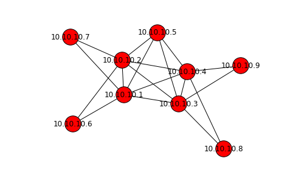

```python
import networkx as nx
%matplotlib inline
```


```python
import tega.driver
d = tega.driver.Driver()
edges = d.get('topo.edges')
g = nx.Graph([[edge['source'], edge['target']] for edge in edges])
nx.draw(g, node_size=700, with_labels=True)
```




