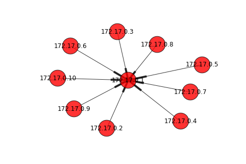
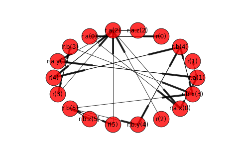

```python
import networkx as nx
%matplotlib inline
```


```python
import tega.driver
d = tega.driver.Driver()
```


```python
_, _, edges = d.edges(root_oid='r', old_roots=False)
instance=d.get(path='r')
print(instance)
```

    {'b': {'x': 4, 'z': 6, 'y': 5}, 'a': {'x': 1, 'z': 3, 'y': 2}}


```python
g = nx.DiGraph(edges)
nx.draw_spring(g, node_size=1000, with_labels=True, arrows=True, alpha=0.8)
```





```python
_, _, edges = d.edges(root_oid='r', old_roots=True)
instance=d.get(path='r', internal=True, python_dict=True)
print(instance)
```

    {'b': {'_version': 5, '_oid': 'b', 'x': {'_parent': 'b', '_oid': 'x', '_value': 4, '_ephemeral': False, '_version': 3}, 'z': {'_parent': 'b', '_oid': 'z', '_value': 6, '_ephemeral': False, '_version': 5}, '_parent': 'r', 'y': {'_parent': 'b', '_oid': 'y', '_value': 5, '_ephemeral': False, '_version': 4}, '_ephemeral': False}, '_version': 5, '_oid': 'r', 'a': {'_version': 2, '_oid': 'a', 'x': {'_parent': 'a', '_oid': 'x', '_value': 1, '_ephemeral': False, '_version': 0}, 'z': {'_parent': 'a', '_oid': 'z', '_value': 3, '_ephemeral': False, '_version': 2}, '_parent': 'r', 'y': {'_parent': 'a', '_oid': 'y', '_value': 2, '_ephemeral': False, '_version': 1}, '_ephemeral': False}, '_parent': None, '_ephemeral': False}


```python
g = nx.DiGraph(edges)
nx.draw_circular(g, node_size=1000, with_labels=True, arrows=True, alpha=0.8)
```





```python

```
